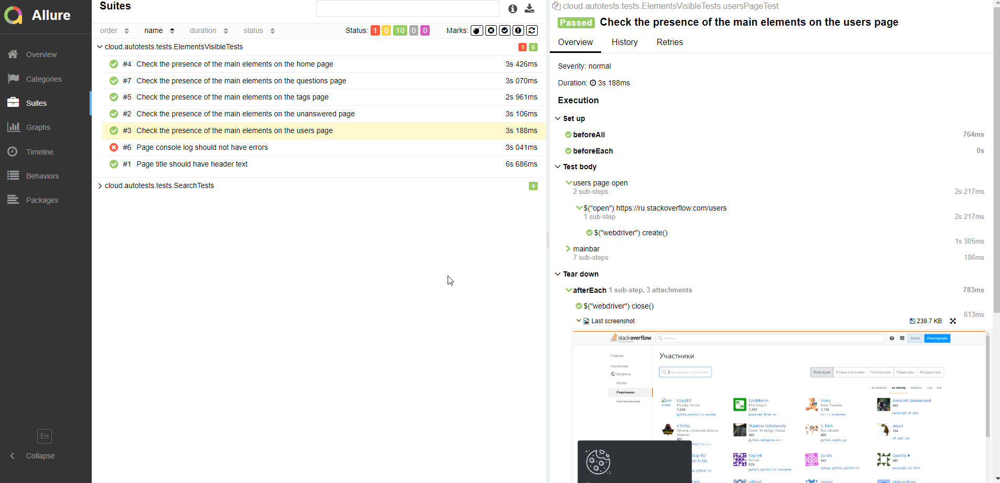
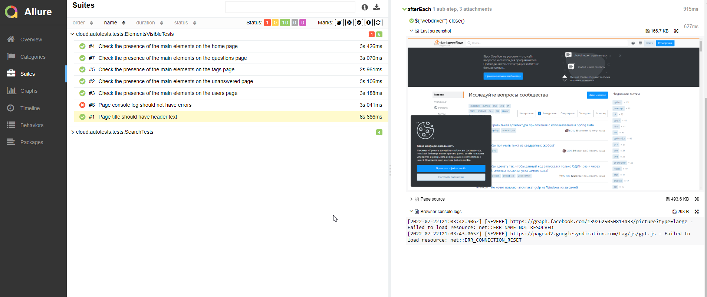
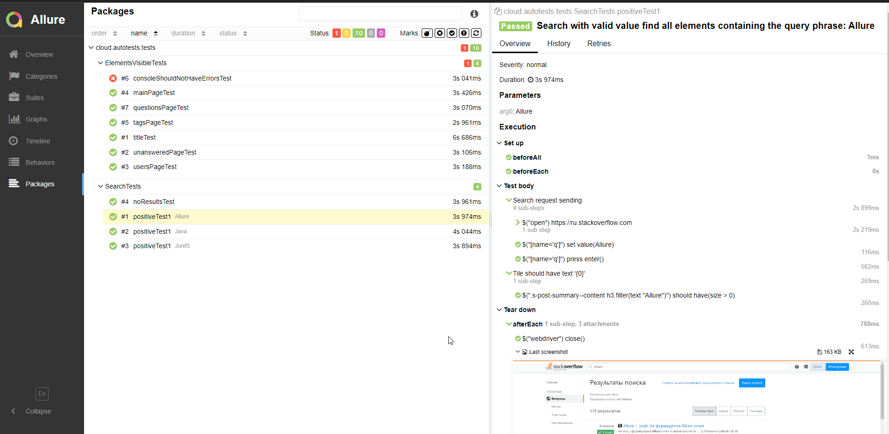
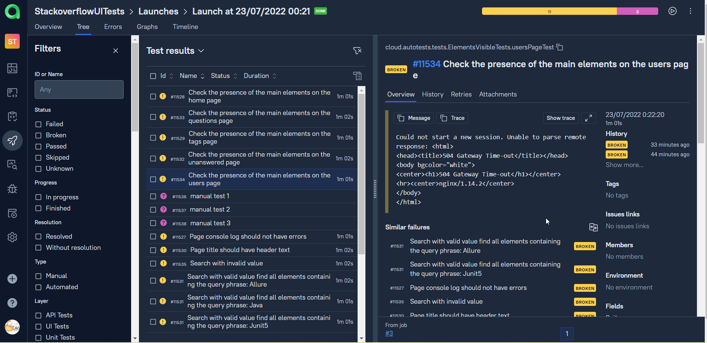
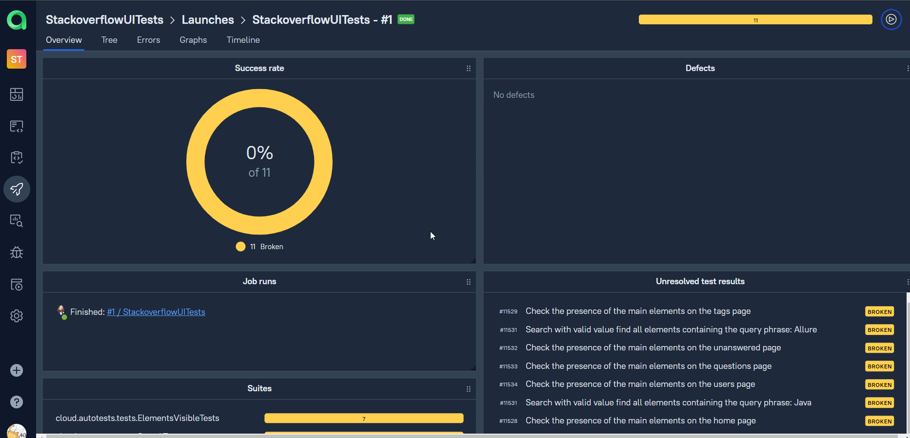
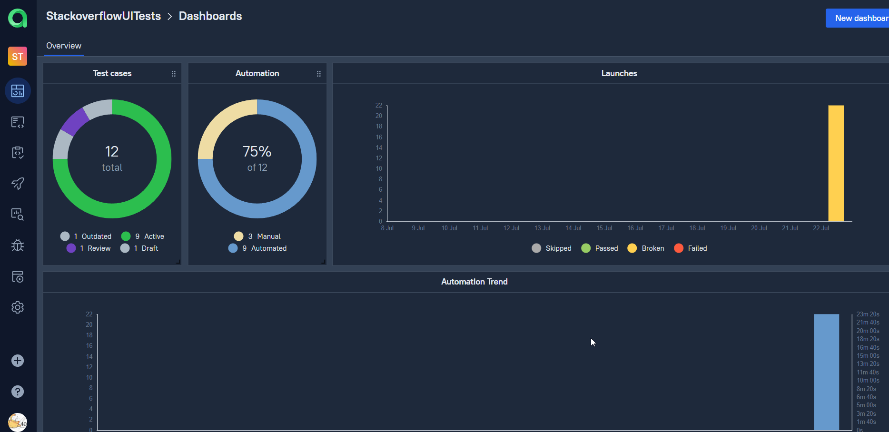
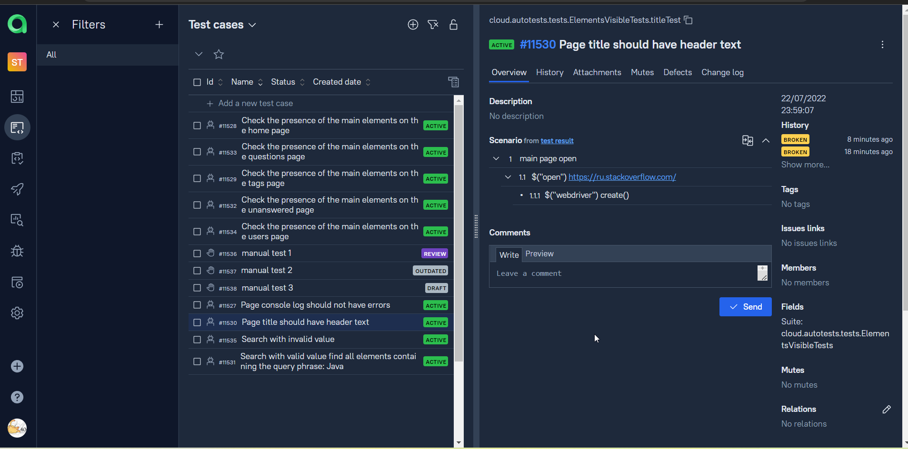
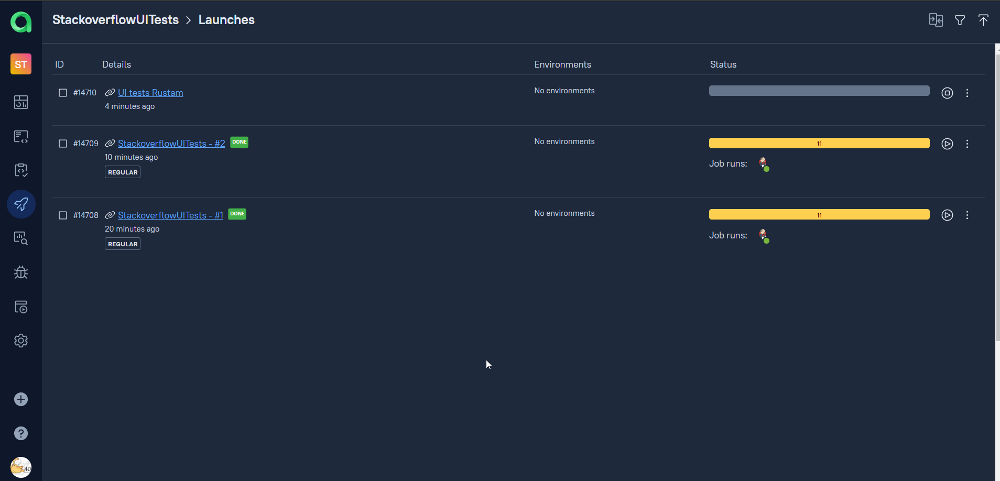

# Проект по автоматизации тестирования для Stackoverflow
## <a target="_blank" href="https://ru.stackoverflow.com/">Веб сайт Stackoverflow</a>


## :rocket: Содержание:

- [x] <a href="#rocket-технологии-и-инструменты">Технологии и инструменты</a>
- [x] <a href="#rocket-реализованные-проверки">Реализованные проверки</a>
- [x] <a href="#rocket-сборка-в-Jenkins">Сборка в Jenkins</a>
- [x] <a href="#rocket-запуск-из-терминала">Запуск из терминала</a>
- [x] <a href="#rocket-allure-отчет">Allure отчет</a>
- [x] <a href="#rocket-интеграция-с-allure-testops">Интеграция с Allure TestOps</a>
- [x] <a href="#rocket-интеграция-с-jira">Интеграция с Jira</a>
- [x] <a href="#rocket-отчет-в-telegram">Отчет в Telegram</a>
- [x] <a href="#rocket-видео-примеры-прохождения-тестов">Видео примеры прохождения тестов</a>

## :rocket: Технологии и инструменты
<p align="center">


</p>

## :rocket: Реализованные проверки это UI тесты

- Наличие основных элементов главной страницы
- Наличие основных элементов страницы вопросов
- Наличие основных элементов страницы меток
- Наличие основных элементов страницы участников
- Наличие основных элементов страницы неотвеченные
- Результаты работы поиска с валидными данными
- Результаты работы поиска с невалидными данными

## :rocket: Сборка в Jenkins
### <a target="_blank" href="https://jenkins.autotests.cloud/job/StackoverflowUITests/">Сборка в Jenkins</a>
<p align="center">

</p>

### Параметры сборки в Jenkins:
Сборка в Jenkins

- browser (браузер, по умолчанию chrome)
- version (версия браузера, по умолчанию 100.0)
- size (размер окна браузера, по умолчанию 1920x1080)
- threads (количество потоков)

## :rocket: Запуск из терминала
Локальный запуск:
```
gradle clean test
```

Удаленный запуск:
```
clean
test
-Dbrowser=${BROWSER}
-DbrowserVersion=${BROWSER_VERSION}
-DbrowserSize=${BROWSER_SIZE}
-DbrowserMobileView="${BROWSER_MOBILE}"
-DremoteDriverUrl=https://${REMOTE_LOGIN}:${REMOTE_PASSWORD}@${REMOTE_DRIVER_URL}/wd/hub/
-DvideoStorage=https://${REMOTE_DRIVER_URL}/video/
-Dthreads=${THREADS}
```

## :rocket: Allure отчет
- ### Главный экран отчета
<p align="center">

</p>

- ### Проведенные тесты (suites)
<p align="center">


</p>

- ### Пакетами тестов
<p align="center">

</p>

- ### График прохождения тестов
<p align="center">

</p>

## :rocket: Интеграция с Allure TestOps
- ### Результаты запуска тестов
<p align="center">

</p>

- ### Launches после интеграции с IDE + график
<p align="center">

</p>

- ### Дашборды с ручными и авто тестами
<p align="center">

</p>

- ### Тест кейсы
<p align="center">

</p>

- ### Запуски с ручными и авто тестами
<p align="center">

</p>

## :rocket: Интеграция с Jira
- ### Задачей в Jira
<p align="center">

</p>

## :rocket: Отчет в Telegram
<p align="center">

</p>

## :rocket: Видео примеры прохождения тестов
> К каждому тесту в отчете прилагается видео. Одно из таких видео представлено ниже.
> На данный момент школьный ресурс оптимизируется, я предоставил результаты своей работы невзирая на преграды.
<p align="center">
  
</p>


